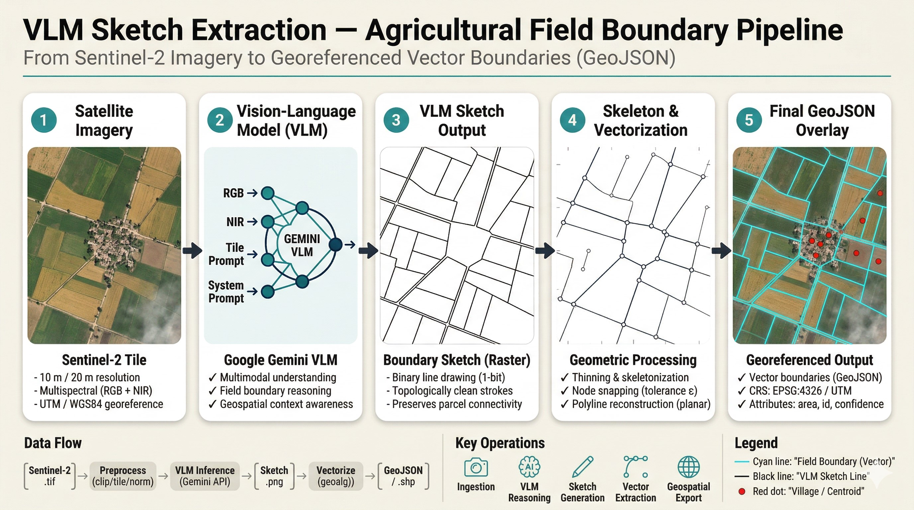
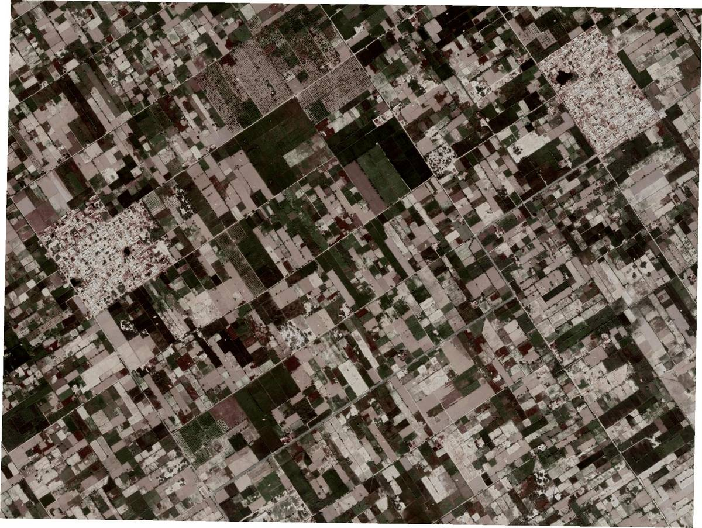
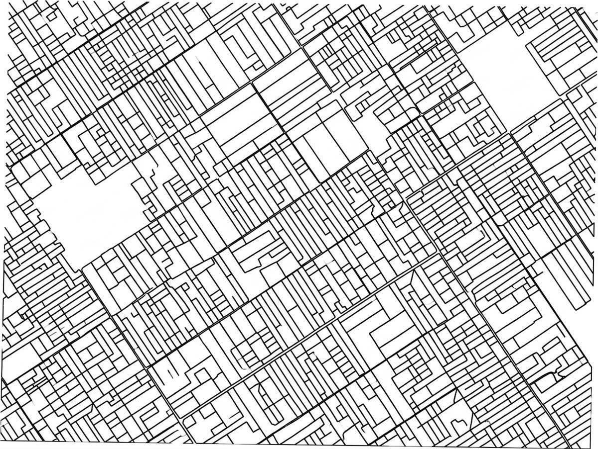
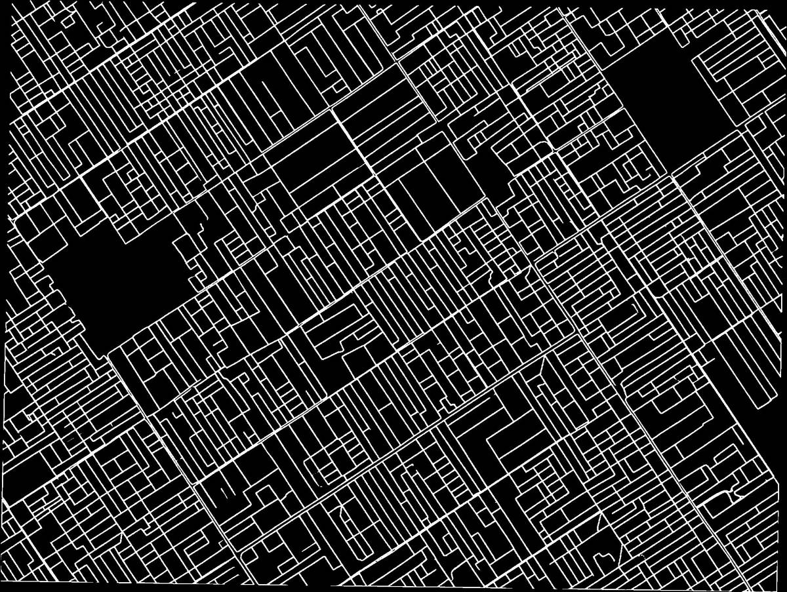
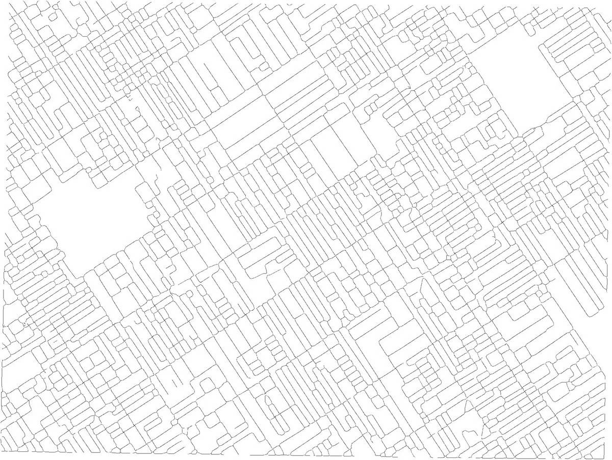
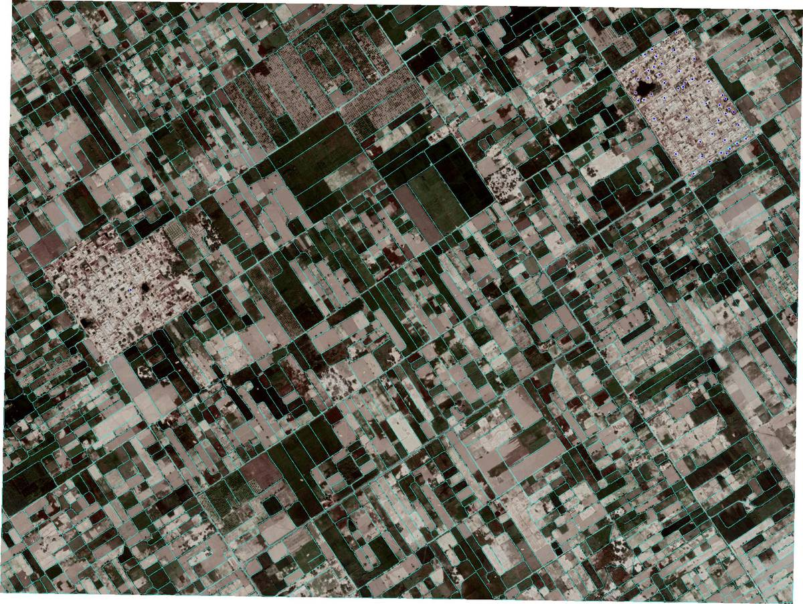
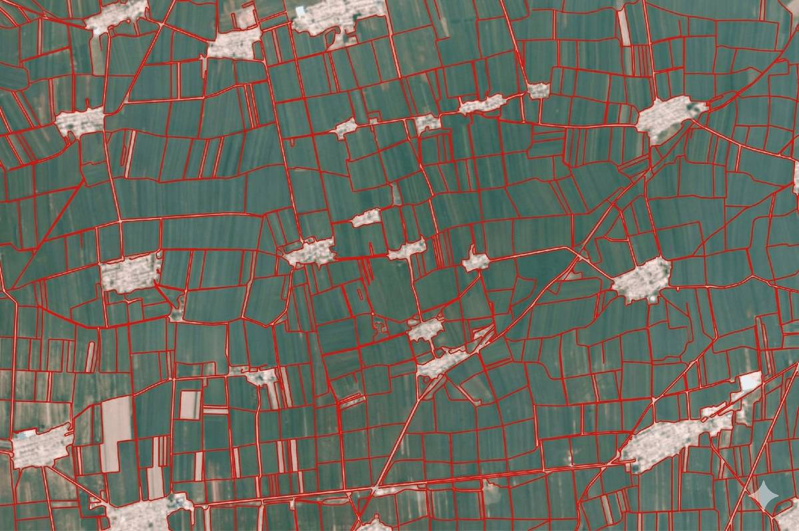

# vlm-field-tracer

**VLM Sketch Extraction for Agricultural Field Boundaries**  
*A zero-shot pipeline that uses a Vision Language Model to draw and extract field boundary lines from satellite imagery*



[](https://www.python.org/)
[](LICENSE)
[]()

---

## Overview

**vlm-field-tracer** is a novel zero-shot field boundary extraction pipeline. Rather than relying on a pre-trained segmentation model, it uses a **Vision Language Model (Gemini)** as a geospatial annotator — prompting it to visually *sketch* field boundary lines and urban point markers directly onto satellite tiles — then applies a rigorous computer vision post-processing chain to convert those sketches into accurate, georeferenced vector outputs.

This method — **VLM Sketch Extraction** — is complementary to trained approaches like [Fields of The World (FTW)](https://fieldsofthe.world). It is especially useful for regions with limited training data coverage where a rapid zero-shot baseline is needed.

```
GeoTIFF → Tile → VLM Sketch → Binary Mask → Skeleton → Trace → Geo-convert → GeoJSON + SHP
```

---

## Key Features

- **Zero-shot inference** — no region-specific training data required
- **Dual output** — field boundary lines *and* urban/non-agricultural point markers in one run
- **Gap-free lines** — Otsu thresholding + morphological closing + skeleton gap bridging
- **Straight clean geometry** — staircase artefact removal via bearing-based line straightening
- **Tiled processing** — configurable NxM grid for large images exceeding API limits
- **Full geospatial output** — GeoJSON + ESRI Shapefile with CRS, metadata, and UUID per feature
- **Debug pipeline** — 13 intermediate PNG snapshots saved per tile for full transparency
- **Auto CRS detection** — multi-fallback EPSG detection (WKT, EPSG string, UTM regex, coordinate heuristics)

---

## Repository Structure

```
vlm-field-tracer/
├── vft/                       # Core package (VLM Field Tracer)
│   ├── __init__.py
│   ├── loader.py              # GeoTIFF loader + CRS detection
│   ├── tiling.py              # Grid tiling + API size preparation
│   ├── vlm.py                 # Gemini API call + prompts
│   ├── skeleton.py            # Gap bridging, straightening, snapping
│   ├── tracer.py              # Skeleton graph tracers
│   ├── extractor.py           # extract_lines + extract_points
│   ├── overlay.py             # Final overlay PNG
│   ├── writer.py              # GeoJSON + SHP output
│   └── debug.py               # Debug PNG saver
├── docs/
│   ├── architecture/          # Pipeline architecture diagrams
│   │   └── README.md
│   └── diagrams/              # Result screenshots and comparisons
│       └── README.md
├── test_imagery/              # Sample GeoTIFFs for testing (gitignored)
│   └── README.md              # How to download Sentinel-2 test tiles
├── outputs/                   # All run outputs go here (gitignored)
│   └── README.md
├── __main__.py                # CLI entry point
├── requirements.txt
├── CHANGELOG.md
├── LICENSE
├── .gitignore
└── README.md
```

---

## Installation

**1. Clone the repository**
```bash
git clone https://github.com/<your-username>/vlm-field-tracer.git
cd vlm-field-tracer
```

**2. Create a virtual environment**
```bash
python -m venv venv
source venv/bin/activate      # Linux / macOS
venv\Scripts\activate         # Windows
```

**3. Install dependencies**
```bash
pip install -r requirements.txt
```

**4. (Optional) Install opencv-contrib for best skeleton thinning**
```bash
pip install opencv-contrib-python
```
> Without it, the pipeline falls back to morphological thinning — still functional, slightly lower junction quality.

**5. Get a Gemini API key**  
Visit [Google AI Studio](https://aistudio.google.com/) → create an API key.

---

## Usage

### Basic — single image
```bash
python -m vft field.tif -k YOUR_GEMINI_API_KEY
```

### Grid tiling — for large images
```bash
python -m vft field.tif -k YOUR_KEY --grid 2x2
python -m vft field.tif -k YOUR_KEY --grid 3x3
```

### Force EPSG / custom CRS
```bash
python -m vft field.tif -k YOUR_KEY --epsg 32643
```

### Custom output directory
```bash
python -m vft field.tif -k YOUR_KEY -o outputs/my_run/
```

### Fine-tune line quality
```bash
python -m vft field.tif -k YOUR_KEY --angle-tolerance 5.0   # stricter straight lines
python -m vft field.tif -k YOUR_KEY --angle-tolerance 15.0  # allow curved boundaries
python -m vft field.tif -k YOUR_KEY --max-gap 40            # bridge larger gaps
python -m vft field.tif -k YOUR_KEY --snap-tolerance 3.0    # snap endpoints
```

---

## Parameters Reference

| Parameter | Default | Description |
|---|---|---|
| `input` | — | Input GeoTIFF path |
| `-k` / `--api-key` | — | Gemini API key (required) |
| `-o` / `--output` | `.` | Output directory |
| `--grid` | off | Tile grid e.g. `2x2`, `3x3` |
| `--epsg` | auto | Force EPSG code |
| `--min-line` | `20` | Minimum line length in pixels |
| `--min-dot` | `30` | Minimum dot area in px² |
| `--snap-tolerance` | `0` | Endpoint snap in geo units (0 = auto) |
| `--dp-epsilon` | `3.0` | Douglas-Peucker simplification (px) |
| `--max-gap` | `25` | Max skeleton gap to bridge (px) |
| `--angle-tolerance` | `8.0` | Bearing deviation for straightening (degrees) |

---

## Output Files

| File | Description |
|---|---|
| `<stem>_vft_lines.geojson` | Field boundary LineStrings with metadata |
| `<stem>_vft_points.geojson` | Urban/non-agricultural Point markers |
| `<stem>_vft_combined.geojson` | All features combined |
| `<stem>_vft_lines.shp` | Shapefile (lines) — loads in QGIS / ArcGIS |
| `<stem>_vft_points.shp` | Shapefile (points) |
| `<stem>_debug_pngs/` | 13-step pipeline debug images |

Each GeoJSON feature carries: `id` (UUID), `type`, `length`, `vertices`, `source`, `model`, `created` (UTC timestamp), and `epsg`.

---

## Pipeline Architecture

See [`docs/architecture/README.md`](docs/architecture/README.md) for the full flowchart and module dependency graph.

```
Input GeoTIFF
     │
  [loader]  ── Full-res load, CRS detection
     │
  [tiling]  ── NxM grid split, geo bounds per tile
     │
  ┌──┴─────────────────────────┐
  │  Per tile:                 │
  ▼                            ▼
[vlm] PROMPT_LINES        [vlm] PROMPT_POINTS
  │                            │
  ▼                            ▼
[extractor]               [extractor]
  mask→skeleton→trace       dots→centroid→geo
  →geo-convert→merge
  │                            │
  └──────────┬─────────────────┘
             ▼
          [overlay] ── draw on original image
             │
          [writer]  ── GeoJSON + SHP + metadata
```

---

## The Method — VLM Sketch Extraction

**VLM Sketch Extraction** prompts a Vision Language Model to *draw* the boundaries it perceives on a satellite tile, then recovers vector geometry from that drawing through computer vision.

**Advantages:**
- Zero training data required for any new region
- Instant global coverage
- Human-interpretable intermediate output (the VLM sketch)
- Tunable geometry via post-processing parameters

**Tradeoff:** accuracy depends on the VLM's visual interpretation, making this best suited as a **rapid baseline and exploration tool** rather than a production replacement for trained segmentation models.

---

## Results

Real pipeline output on a Sentinel-2 tile over an agricultural region.

<table>
  <tr>
    <td align="center">
      <br/>
      <b>① Input Satellite Imagery</b><br/>
      <sub>Sentinel-2 RGB GeoTIFF</sub>
    </td>
    <td align="center">
      <br/>
      <b>② VLM Sketch Output</b><br/>
      <sub>Gemini black-on-white boundary sketch</sub>
    </td>
    <td align="center">
      <br/>
      <b>③ Skeleton & Gap Bridging</b><br/>
      <sub>1-px centreline after gap reconnection</sub>
    </td>
  </tr>
  <tr>
    <td align="center">
      <br/>
      <b>④ Final Extracted Lines</b><br/>
      <sub>Georeferenced LineStrings after merge & snap</sub>
    </td>
    <td align="center">
      <br/>
      <b>⑤ Final GeoJSON Overlay</b><br/>
      <sub>Vector boundaries + urban centroids on imagery</sub>
    </td>
    <td align="center">
      <br/>
      <b>⑥ Other output</b><br/>
      <sub>Output for Sentinel 2</sub>
    </td>
  </tr>
</table>

## Relation to Fields of The World (FTW)

Inspired by the [FTW initiative](https://fieldsofthe.world) by Taylor Geospatial / ASU Kerner Lab / Microsoft AI for Good.

| | FTW (Phase 2) | vlm-field-tracer |
|---|---|---|
| **Approach** | Trained segmentation (U-Net + EfficientNet-b3) | Zero-shot VLM sketch extraction |
| **Training data** | 1.6M labeled field boundaries | None required |
| **Accuracy** | Benchmarked (IoU, 24 countries) | Qualitative |
| **Coverage** | 24 countries, 4 continents | Anywhere |
| **Output** | Field polygons | Field boundary lines + urban points |
| **Best for** | Regions in training coverage | New/unseen regions, rapid baseline |

---

## Satellite Imagery

- **Source:** Copernicus Sentinel-2A/2B/2C (`COPERNICUS/S2_SR_HARMONIZED` in GEE)
- **Bands:** RGB (B4, B3, B2), 10m resolution
- **Cloud cover:** < 20% recommended
- **Seasonality:** Two-date composites (planting + harvest) improve boundary clarity

See [`test_imagery/README.md`](test_imagery/README.md) for a ready-to-use GEE export script.

---

## License

MIT — see [LICENSE](LICENSE)

---

## Acknowledgements

- [Fields of The World (FTW)](https://fieldsofthe.world) — Taylor Geospatial / ASU Kerner Lab / Microsoft AI for Good
- [Google Gemini](https://ai.google.dev/) — VLM backbone
- [Copernicus / ESA](https://www.copernicus.eu/) — Sentinel-2 satellite imagery
